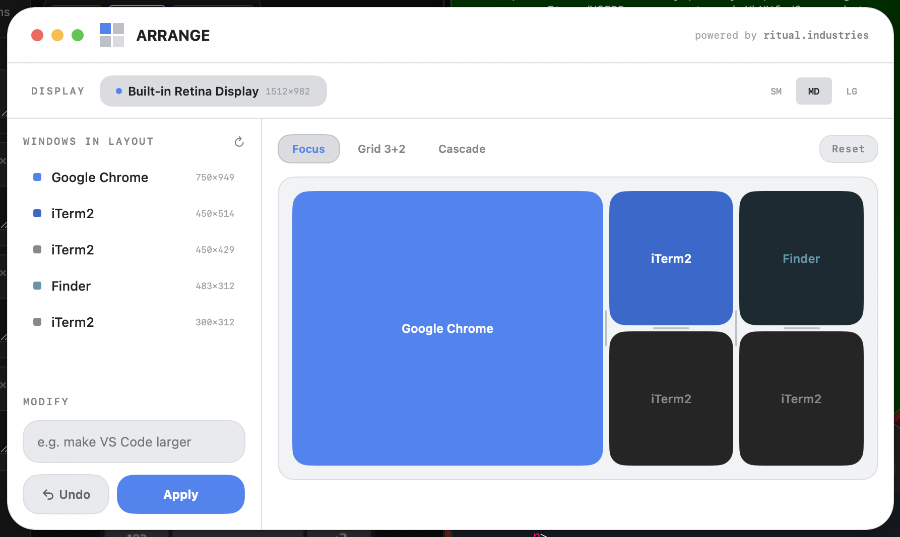

# Arrange

> ## ⚠️ Before you start — what YOU (the human) must do
>
> An AI agent can run every command in this README, but a few things require **you**, because macOS and Apple security won't let any script do them. Read this first.
>
> **You need installed first:**
> - **Xcode** (full app, not just CLT)
> - XcodeGen (`brew install xcodegen`)
>
> **Steps only a human can do (your AI agent will pause and ask for these):**
> - **Grant Accessibility permission** when first launched: System Settings → Privacy & Security → Accessibility → enable Arrange. *Without this it cannot move any windows.*
> - *(Optional, for the AI-modify feature only)* paste an **Anthropic API key with billing enabled** into Settings.

A macOS menu bar utility for arranging windows into layouts — instantly.



## Download

**[Download Arrange.zip](https://github.com/brianharms/arrange/releases/latest/download/Arrange.zip)**

Unzip and move `Arrange.app` to your `/Applications` folder.

> **Note:** Arrange is not notarized. On first launch, right-click the app and choose **Open** to bypass Gatekeeper.

## What it does

Arrange detects all open windows on your screen and lets you snap them into clean layouts with one click. Pick a preset (Focus, Grid, Cascade, Trident, and more), drag windows between slots to reassign them, or type a natural language instruction to modify the layout with AI.

- **Layout presets** — Single, Halves, Focus, Stack, Thirds, Sidebar, Grid, Cascade, Cockpit, Trident
- **Drag to reorder** — swap windows between slots in the canvas preview
- **Resize seams** — drag the dividers to adjust column/row proportions live
- **AI modify** — type something like "make Chrome bigger on the left" and it adjusts the layout
- **Undo / Reset** — restore previous window positions at any time
- **Multi-monitor** — select which display to arrange
- **Theme system** — 6 styles, 14 color palettes, 3 fonts, dark/light mode

## Requirements

**To run the app:**
- macOS 14.0 (Sonoma) or later
- Accessibility permissions (prompted on first launch — required to detect and move windows)
- *(Optional)* an [Anthropic API key](https://console.anthropic.com/) **with billing enabled** for the AI layout-modification feature. The app works fully without it; only AI modify needs it.

**To build from source (in addition to the above):**
- **Xcode** — the full IDE, not just the Command Line Tools (`xcodebuild` + a macOS app build need it). Install from the App Store; confirm with `xcodebuild -version`.
- **[XcodeGen](https://github.com/yonaskolb/XcodeGen)** — `brew install xcodegen` (the `.xcodeproj` is generated from `project.yml`).

## Usage

1. Launch Arrange — it lives in your menu bar
2. Press **Ctrl + Option + A** to open/close the panel
3. Pick a layout preset from the tabs
4. Hit **Apply** to snap your windows into place

For AI layout modification, go to **Settings** and enter your [Anthropic API key](https://console.anthropic.com/).

## Build from source

With Xcode + XcodeGen installed (see Requirements):

```bash
brew install xcodegen          # if not already installed
make build                     # xcodegen generate + xcodebuild
make run                       # launch the built app
```

`make build` runs `xcodegen generate` (producing `Arrange.xcodeproj` from `project.yml`) then `xcodebuild`. To open in the IDE instead: `xcodegen generate && open Arrange.xcodeproj`.

## For AI coding agents

If you're an agent working **on** this project:

**Repo layout**
- `Arrange/Sources/` — all Swift. `ArrangeApp.swift` (entry), `AppDelegate.swift`, `Models/` (`LayoutPreset`, `LayoutState`, `SavedLayout`, `ScreenInfo`, `WindowInfo`), `Services/` (`AccessibilityService` — window detection/movement via the Accessibility API; `LayoutEngine` — preset→frame math; `ClaudeService` — the AI-modify call), plus the SwiftUI views.
- `project.yml` — XcodeGen spec; the `.xcodeproj` is generated from it (don't hand-edit the generated project).
- `Makefile` — `generate` / `build` / `run` targets.
- `Arrange/Info.plist`, `screenshot.png`, `LICENSE` (MIT), `.gitignore`.

**Build / run / test**
- `make build` then `make run`. No automated test suite — verify by launching and applying layouts against real windows (needs Accessibility permission granted to the built app).
- Build is unsigned (`CODE_SIGNING_ALLOWED=NO`); for distribution, sign with your own team.

**Invariants — do not break**
- **Window control goes through `AccessibilityService`.** It uses the macOS Accessibility API; the app is useless without the user granting Accessibility permission. Don't bypass it or assume permission.
- **No API key in source.** `ClaudeService` reads the Anthropic key from app Settings (user-entered) at runtime — never hardcode or commit one. The AI feature must stay optional; the app fully works without a key.
- **`project.yml` is the source of truth** for the Xcode project. Edit it and regenerate; don't commit hand edits to the generated `.xcodeproj` internals.
- **Bundle ID / signing are user-supplied.** Keep them generic/blank for contributors to set their own.

## License

MIT © 2026 Brian Harms / Ritual Industries — [ritual.industries](https://ritual.industries)
